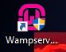
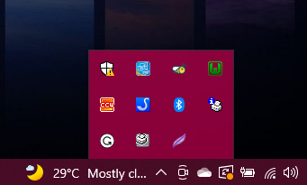
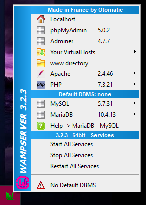
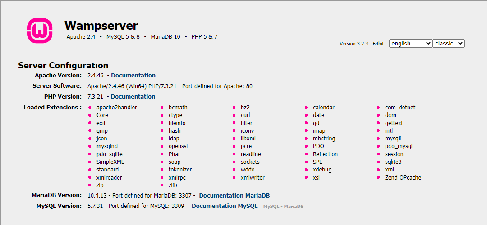
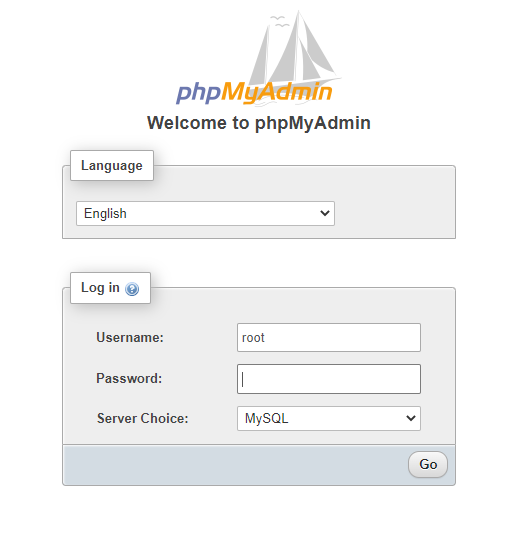
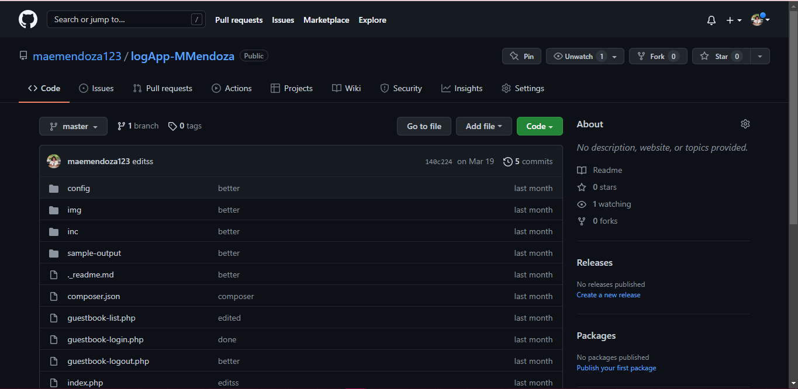
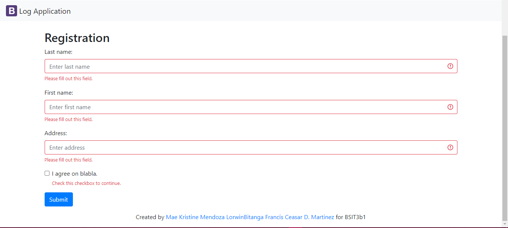
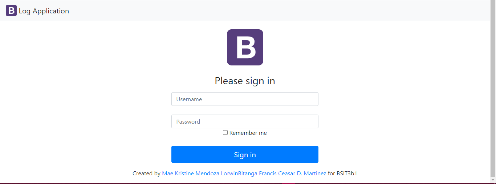
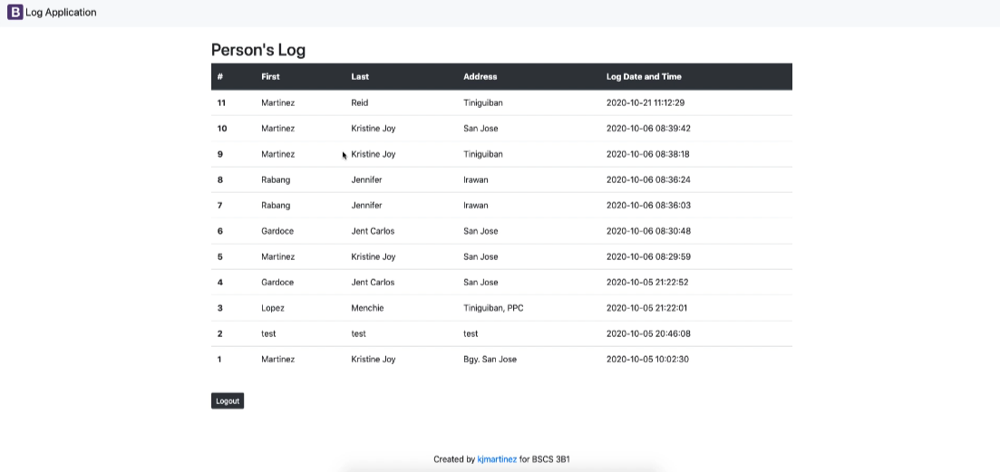

# LogApp 

### A LogApp is a web-based application which composed of a recorded file events. It is like an online logbook of activities like registration,guestbook-login, guestbook-list, and guestbook-logout. This markdown file will guide you on how to make a LogApp.
---
:computer: Softwares to be used: 
---
- Visual Studio Code
- Github account
- WampServer or Xampp (Database)
---
:link: Installers and Links:
---
- WampServer https://www.wampserver.com/en/
- Create Github Account https://github.com/
- Xampp https://www.apachefriends.org/index.html
---
:inbox_tray: Installation
---
### 1. Prepare the installed WampServer or Xampp which has a phpMyadmin and localhost of Mysql for database management. I used the WampServer in making LogApp.
  
### :triangular_flag_on_post: WampServer  
---  

  - 
 
  - 
  
  - 
---
### :triangular_flag_on_post: localhost 
  
 
 
---
### :triangular_flag_on_post: phpMyAdmin
 - Log in your account in phpMyAdmin.
 - Create database.
 - Import or export of database from local files.
 - Edit
 - Save

 

---
### 2. Clone your repository link/file from Github to your local path. Make sure it will save in your preferred location like Desktop or ***www*** folder of Wamp.  

- Mendoza Github Account LogApp Repository: https://github.com/maemendoza123/logApp-MMendoza

 
 
---
### 3. Open the WampServer on the browser. If you will edit the database, you choose the phpMyAdmin or if you want to see the result of the code, you open the localhost. Then paste the URL or location of the file.
---
## :hourglass: Log Application

 #### :clipboard: Registration Form
 
 ##### It shows the needed information about the person who will register on the form.

 

---
#### :clipboard: Guestbook-Login

 ##### It shows the login form which the admin or the person who have access can see the list of the guest.

 

---
#### :clipboard: Guestbook-List

 ##### It shows the list of the guest with their information.

 

---
## :sparkler: Authors
 
:mortar_board: Mae Kristine V. Mendoza  

:mortar_board: Francis Ceasar D. Martinez

:mortar_board: Lorwin E. Bitanga

---
